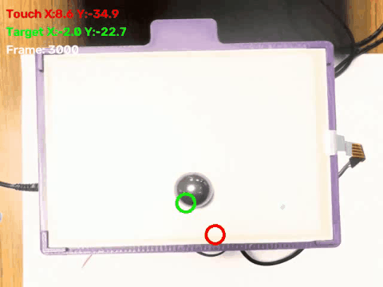

# VRI 2026: Ball-Balancing Robot

### Bronze System Demo

Demonstration of the integrated system balancing the ball using early iterations of the vision pipeline.


### Raw RGB Camera Feed

Raw 60fps camera feed captured for the ML datasets before homography warping is applied.


### Vision/Platform Sync Check

Diagnostic visualization validating the latency and synchronization between camera frames and the physical platform kinematics.


A fully autonomous, multi-modal ball-balancing robot built using a highly distributed architecture. This system leverages Machine Learning (Computer Vision and Audio Classification), high-speed FPGA hardware acceleration, and precision stepper motor control to dynamically balance a ball on a moving platform.

## 🏗️ System Architecture

This monorepo is divided into five domain pillars. For how these map onto the project's
Phase/Track/Arm terminology (e.g. "Phase 6," "Arm 2") and current per-module status, see
`CLAUDE.md`'s "Terminology" and "Current State" sections — this README stays a fixed
architectural map, not a status tracker, so it doesn't drift out of sync the way a
duplicated status table would.

### 1. Host Software (`/host_software`)

The "Brain" of the robot, written entirely in Python and running on the Host PC.

- **Machine Learning Vision (`/ml_vision`)**: A Shared Encoder Backbone CNN (one CNN, two heads) performs ArUco-homography-corrected ball and marker tracking from the camera feed. A separate "medium class" (YOLO/ResNet-lineage) vision pipeline also exists as an open comparison candidate — see `CLAUDE.md`'s Architecture Decisions table.
- **Machine Learning Audio (`/ml_audio`)**: A voice command classifier that allows users to issue verbal instructions to the robot (e.g., "go red", "hold", "stop").
- **Multimodal / VLA (`/ml_multimodal`, `/ml_jetson_vla`)**: The project's current major goal — a 3-arm comparison (this expert pipeline / a large Qwen-derived model / a photonic computing platform) converging on an NVIDIA Jetson AGX Orin. See `host_software/ml_jetson_vla/docs/ARCHITECTURE.md`.
- **Data Collection (`/data_collection`)**: Scripts designed to aggressively pull raw video frames and touchscreen coordinate data to build robust training datasets.
- **Experimental Variants (`/experimental_variants`)**: **Deprecated, read-only reference** — legacy entry-point variants (PyTorch, ONNX, ResNet, PID, etc.) kept for project history. Do not add new files here.

### 2. Edge Control Firmware (`/firmware`)

The active controller running on an **STM32 microcontroller**.
It runs the high-speed motor control loops and actively hosts the exported weights of the `ml_control` policy (e.g. Reinforcement Learning models) to perform edge inference for stabilization. It receives high-level states (Vision and Audio commands) from the Host PC via USB Serial.

### 3. FPGA Hardware Research (`/fpga`)

A **Zynq-7000 (ZedBoard)** (and historically Opal Kelly XEM3010). Its role was reframed
2026-08-13 away from on-chip vision inference: it now targets a digital↔optical bridge for
the photonic VLA comparison arm, plus a PID/Inverse-Kinematics HLS core. Camera→UDP video
streaming remains a separately unresolved problem.

### 4. Physical Hardware (`/hardware` & `/docs`)

Contains all the mechanical and electrical blueprints.

- **`/hardware/cad`**: 3D printable STL files and CAD assemblies for the robot's mechanical structure.
- **`/docs`**: Circuit diagrams, wiring schematics, and rigorous inverse kinematics derivations.

## 🚀 Getting Started

### 1. STM32 Firmware

1. Open the `/firmware/stm32_ml_control_and_vision` project in PlatformIO or Arduino IDE.
2. Compile and flash the code to your STM32.
3. Ensure the STM32 is connected to the Host PC via USB.

### 2. Python Environment

To install the necessary host software dependencies (including required libraries like PyTorch, Ultralytics, and ONNX Runtime):

```bash
conda env create -f environment.yml
# OR
pip install -r requirements.txt
```

### 3. Running the Robot

1. Ensure the USB Webcam and the STM32 are plugged into the Host PC.
2. Execute the primary integrated host software pipeline (handles Vision, Audio, and communication with the STM32):

```bash
cd host_software
python main_onnx_shared_vision_audio.py
```

(`main_onnx_aruco_audio.py` still exists and runs the earlier cascaded CNN+MLP pipeline —
`main_onnx_shared_vision_audio.py` is the actively-developed one, using the Shared Backbone
CNN and adding marker detection.)

### 4. Fetching Data & Model Weights

Curated datasets (`03_gold`, `03_synthetic_yolo`, `yolo_raw_dataset`) and model
weights (`ml_vision/models/`, `ml_audio/data/`, `ml_audio/models/`,
`ml_multimodal/models/`) are version-controlled with **DVC**, backed by a home
server (MinIO over Tailscale) rather than Git — install `dvc[s3]` (already in
`requirements.txt`/`environment.yml`), join the home server's Tailscale network
(human step, see `home_server/docs/CONNECTING_A_NEW_DEVICE.md`), configure the
remote's credentials (see `home_server/docs/DVC_SETUP.md`), then:

```bash
dvc pull
```

Raw/intermediate data (`01_bronze`, `02_silver`) deliberately stays **outside**
DVC — too many small files per session for that to be practical; see
`docs/DATA_STORAGE.md` for the full policy and the Colab-specific setup
(`home_server/docs/COLAB_SETUP.md`) for running notebooks without a normal
Tailscale client.
