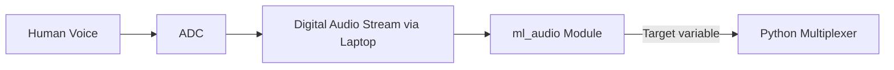
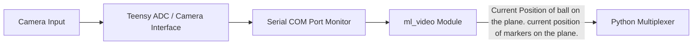
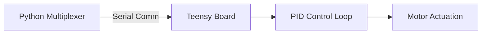

# Ball Balancing Bot: Signal Flow Architecture

This document describes the overall signal flow and system architecture for the audio, video, and control subsystems.

## System Overview

The system consists of three primary modules:
1. **Audio Subsystem (`ml_audio`)**: Processes human voice commands to determine the desired target location for the ball.
2. **Video Subsystem (`ml_video`)**: Processes camera input to track the current position of the ball.
3. **Control Subsystem (Teensy PID)**: Computes the required motor outputs to move the ball to the target position based on current telemetry.

A central Python Multiplexer bridges the machine learning (ML) subsystems and the hardware controller.

## 1. Audio Signal Flow

The audio subsystem is responsible for capturing human voice commands and inferring the target location.

*(Note: Documentation for the `ml_audio` model is pending and will be provided by the lab partner.)*

## 2. Video Signal Flow

The video subsystem is responsible for visual tracking of the ball on the platform.

*(Note: Refer to the `ml_video` Python codebase for implementation details.)*

## 3. Python Multiplexer

The Python Multiplexer, located in the `core_teensy` directory, acts as the central data hub. 

- **Inputs:** 
  - Output from `ml_audio`: Target variable.
  - Output from `ml_video`: Current position of the ball on the plane, and current position of markers on the plane.
- **Outputs:**
  - Current position of the ball.
  - Target position of the ball.

## 4. Control Loop (Teensy)

Data from the Multiplexer is sent back to the Teensy microcontroller, which runs a PID control loop to actuate the platform.

