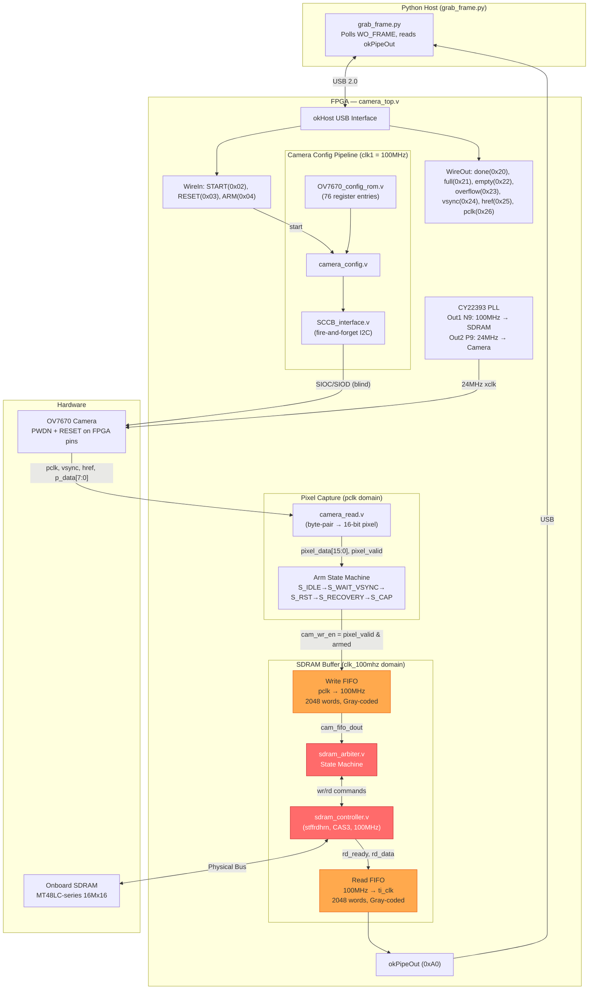

# Camera I2C — Critical Analysis & Remediation Plan

> **Date**: 17 July 2026  
> **Scope**: `fpga/camera_i2c/` directory on the Opal Kelly XEM3010  
> **Current Symptom**: Completely **black frame** since SDRAM implementation. One occasion: horizontal red stripe across the top of the frame.

---

## 1. Current State Summary

| Aspect | Status |
|--------|--------|
| Camera Hardware | OV7670 wired to FPGA via JP3. PWDN and RESET wires connected to FPGA pins. Power on external 3.3V rail. |
| I2C Configuration | Fire-and-forget SCCB — no ACK verification. `done` flag reports success but writes are unverified. |
| Pre-SDRAM Capture | ✅ **Worked** — produced colored (but noisy/corrupted) frames using direct FIFO→USB pipe. |
| Post-SDRAM Capture | ❌ **Black frame** — 614,400 bytes of zeros. One occasion produced a horizontal red stripe at the top. |
| Python Host | `grab_frame.py` correctly polls `WO_FRAME`, arms capture, reads via `okPipeOut`. No timeouts reported. |
| Bitstream | `bitfiles/camera_top.bit` exists (compiled with SDRAM arbiter). A second `without_arm_logic.bit` also present. |

### The Critical Observation

The fact that **pre-SDRAM = colored image** and **post-SDRAM = black** definitively isolates the problem to the **SDRAM buffering data path**, not the camera, I2C, or USB pipe. The camera, pixel capture, and SCCB configuration all functioned well enough to produce visible content before the SDRAM was introduced.

The single occurrence of a **red stripe at the top** is extremely diagnostic — it means a small number of initial rows DID make it through the SDRAM pipeline before the path broke down, proving the camera IS outputting pixels.

---

## 2. Timestamped Troubleshooting Log

| # | Date | Commit | Event | Result |
|---|------|--------|-------|--------|
| 1 | 01 Jul | — | Teensy OV7670 system operational. XCLK fixed to 10MHz (50% duty). Sync header expanded to 8 bytes. CLKRC set to `/1` for max FPS. | ✅ Camera working on Teensy |
| 2 | 02 Jul | `09ee93c` | Initial camera_i2c FPGA files imported. Core Verilog modules from [westonb/OV7670-Verilog](https://github.com/westonb/OV7670-Verilog). | 🔧 Port begins |
| 3 | 02 Jul | `c40e955` | `main_controller/` created as parallel unified top-level. Includes `stepper_motor_controller.v`, `ov7670_capture.v`, `fpga_usb_streamer.v`. | 🔧 Parallel arch |
| 4 | 03 Jul | — | Logbook notes `camera_i2c` conceptually renamed to `main_controller`, but **both directories still exist**. PLL migrated from `ti_clk` to hardware `clk1`. | ⚠️ Directory duplication |
| 5 | 07 Jul | — | Control logic migrated to STM32. FPGA now exclusively for video. Teensy camera modules deleted. | ✅ Architecture clarified |
| 6 | 14 Jul | `d60b634` | camera_i2c files committed. Active development on OV7670 FPGA integration. | 🔧 Active dev |
| 7 | 15 Jul | `2f23cbf` | **Major bug fix session**: (a) CDC metastability on SDRAM arbiter reset — dual-rank synchronizers added. (b) PLL Output 0→Output 2 fix — camera was receiving 48MHz (200% overclock), surviving only 1ms. (c) `v_sup=1'b1` commanding deep sleep — fixed to `1'b0`. (d) SCCB lockup from missing hardware reset sequencing. (e) `siod` changed to `inout wire`. (f) SDRAM arbiter + CDC synchronizers added. | ✅ Major breakthrough — **colored frames achieved** (pre-SDRAM path) |
| 8 | 15 Jul | `2f23cbf` | I2C Configuration Endpoint Bug: `WO_CONF` was mapped to FIFO `empty` (`0x22`) instead of `done`. Python was skipping I2C config entirely. Fixed: `done` → `0x20`. | ✅ Critical fix |
| 9 | 15 Jul | `2f23cbf` | USB FIFO overflow: 640×480 RGB565 at 24MHz overwhelmed 4KB Block RAM FIFO. Workaround: CLKRC divide-by-4 (`0x03`), ~7.5 FPS. | ⚠️ Workaround |
| 10 | 15 Jul | `2f23cbf` | PLL physical mapping: Output 1 (`N9`)=100MHz SDRAM, Output 2 (`P9`)=24MHz camera. CY22393 VCO recalculated: 240MHz÷10=24MHz. UCF constraints updated. | ✅ Critical fix |
| 11 | 16 Jul | `93a82c0` | **SDRAM buffering implemented**. `okBTPipeOut` (block-throttled) returned 614,400 bytes of **zeros** — switched to unthrottled `okPipeOut`. Full frame buffered in SDRAM. Python polls `WO_FRAME` before reading. | ⚠️ **Black frame persists** |
| 12 | 16 Jul | `93a82c0` | `grab_frame.py` captures 5 frames, saves 5th. Script runs without timeouts/errors, but output is all-black. One occurrence of red stripe at top. | ❌ **Current state** |
| 13 | 17 Jul | — | This analysis session. | 📋 |

---

## 3. Architecture



> **Red** = Primary suspects for black frame. **Orange** = Secondary concerns.

---

## 4. Root Cause Analysis — Why Black Frames?

### 🔴 BUG 1 (CRITICAL): `busy` Signal Semantics Mismatch

The stffrdhrn `sdram_controller.v` defines `busy` as:

```verilog
// sdram_controller.v line 205:
busy <= state[4];
```

`state[4]` is only set during **READ** and **WRITE** states (see the state encoding: `READ_ACT=5'b10000`, `WRIT_ACT=5'b11000`). Crucially, `busy` is **LOW** during:
- `INIT_NOP1` through `INIT_NOP4` (the entire initialization sequence!)
- `REF_PRE` through `REF_NOP2` (refresh cycles)
- `IDLE`

The SDRAM arbiter uses `busy` as its gate:
```verilog
// sdram_arbiter.v line 148:
if (!sdram_busy) begin
    if (!cam_fifo_empty) begin
        cam_fifo_rd_en <= 1'b1;  // Start FIFO read
        state <= STATE_WRITE_FETCH;
    end
```

**The Problem**: During the SDRAM initialization sequence (~15 clock cycles after reset), `busy=0`, so the arbiter thinks the controller is idle and starts issuing write commands. But the controller is actually executing `INIT_NOP1→INIT_PRE1→...→INIT_LOAD→INIT_NOP4`. Any write commands issued during this period are **silently ignored** by the controller because its next-state logic only checks `wr_enable` when in the `IDLE` state:

```verilog
// sdram_controller.v line 280-296:
if (state == IDLE)
    ...
    else if (wr_enable) begin
        next = WRIT_ACT;
    end
```

**Result**: The first batch of camera pixels get consumed from the write FIFO and sent to the SDRAM controller, but the controller drops them because it's in its init sequence. Those pixels are **permanently lost**. Depending on timing, this could lose anywhere from a few pixels to the entire frame.

> [!CAUTION]
> This is the most likely root cause of the black frame. The arbiter reads pixels out of the write FIFO and hands them to the SDRAM controller, which silently discards them because it hasn't finished initialization. The arbiter increments `sdram_write_ptr` thinking the data was stored, but the SDRAM locations contain whatever garbage was in RAM. On readback, the host gets zeros or random data.

### 🔴 BUG 2 (CRITICAL): SDRAM Init Reset Behavior

When `rst_n` goes low, the SDRAM controller sets:
```verilog
// sdram_controller.v line 174-181:
state <= INIT_NOP1;
command <= CMD_NOP;
state_cnt <= 4'hf;    // 15 NOP cycles before init starts
busy <= 1'b0;         // ← BUSY IS LOW DURING INIT!
```

After reset deasserts, the controller begins a 15-cycle NOP delay (`state_cnt=4'hf`), then progresses through `INIT_PRE1→INIT_REF1→INIT_NOP2→INIT_REF2→INIT_NOP3→INIT_LOAD→INIT_NOP4→IDLE`. This entire sequence takes approximately **35-40 clock cycles** at 100MHz = 350-400ns.

In `grab_frame.py`, the sequence is:
```python
# Reset pulse (lines 73-77)
fp.SetWireInValue(WI_RESET, 0x1)   # rst_n=0 → SDRAM init starts
fp.UpdateWireIns()
time.sleep(0.01)                    # 10ms delay
fp.SetWireInValue(WI_RESET, 0x0)   # rst_n=1 → init runs from INIT_NOP1
fp.UpdateWireIns()
# NO delay before ARM!
```

The 10ms delay while reset is held provides ample time. After reset deasserts, the SDRAM controller init takes ~400ns. The Python ARM pulse takes ~2ms of USB roundtrip. So by the time the first `frame_start` fires (which takes up to 133ms waiting for VSYNC), the SDRAM init is definitely complete.

**But**: The reset in `grab_frame.py` happens **before** the frame capture loop. On the **first** frame after reset, SDRAM init has time to complete. However, each frame capture triggers `frame_rst` (via the ARM state machine's S_RST state). Let's trace what `frame_rst` does to the arbiter:

```verilog
// sdram_arbiter.v line 133-140:
if (frame_rst_100) begin
    sdram_write_ptr <= 0;
    sdram_read_ptr <= 0;
    sdr_wr_en_cmd <= 0;
    sdr_rd_en_cmd <= 0;
    cam_fifo_rd_en <= 0;
    state <= STATE_IDLE;
end
```

`frame_rst` does NOT re-trigger the SDRAM controller init (only `rst_n` does that). So `frame_rst` only resets the arbiter pointers, which is correct. The SDRAM controller stays running. So Bug 2 only applies to the very first frame after a full reset — and since the Python has ample time, this is likely not the primary issue.

**However**, let's consider the FIRST boot (initial power-on). The SDRAM controller starts in an undefined state. The `rst_n` synchronizer initializes to `2'b11` (not reset), which means **the SDRAM controller may never see a proper reset pulse on cold boot**. If the Python PLL/bitstream configuration process doesn't include a clean reset, the SDRAM controller could be in a random state.

In `grab_frame.py`, there IS a reset pulse before I2C config (lines 50-55) and another after (lines 73-77). So this should be OK.

### 🔴 BUG 3 (CRITICAL): Arbiter Reads During SDRAM Refresh — Data Loss

The SDRAM controller periodically performs refresh cycles (every `CYCLES_BETWEEN_REFRESH` = 781 cycles at 100MHz/64ms/8192). During refresh, `busy=0` (state[4] is 0 for REF_ states), so the arbiter's read path will:

1. See `!sdram_busy && !usb_fifo_full && (sdram_read_ptr < sdram_write_ptr)`
2. Issue `sdr_rd_en_cmd <= 1'b1`
3. Transition to `STATE_READ_WAIT`
4. Wait for `!sdram_busy && !sdr_rd_en_cmd`

But the SDRAM controller, being in `REF_PRE` or `REF_NOP1`, sees `rd_enable` while NOT in `IDLE`. Its next-state logic only acts on `rd_enable` when `state == IDLE`:

```verilog
if (state == IDLE)
    ...
    else if (rd_enable) begin
        next = READ_ACT;
```

So the read command is **silently dropped**. The arbiter waits in `STATE_READ_WAIT`, and since `busy=0` immediately (refresh doesn't set state[4]), the arbiter exits wait on the next cycle thinking the read completed. But `rd_ready` never fires, so no data reaches the read FIFO.

The arbiter then increments `sdram_read_ptr` (already done in STATE_IDLE before entering read) and moves on. **That SDRAM word is permanently skipped** — the USB host will receive a gap of zeros for that position.

> [!WARNING]
> This refresh collision silently corrupts frames by dropping random reads throughout the 307,200-word frame. At 100MHz with refresh every 781 cycles, approximately 393 reads will collide with refreshes during a single frame readout, creating ~393 zero-valued pixels scattered across the image. This could cause subtle corruption rather than a fully black frame.

### 🔴 BUG 4 (CRITICAL): Write Collisions with Refresh — Same Issue for Writes

The exact same logic applies to writes. If the arbiter issues `sdr_wr_en_cmd` while the SDRAM controller is in a refresh cycle, the write is dropped. Camera pixels are consumed from the write FIFO but never stored in SDRAM.

If this happens frequently enough during the frame write phase, a significant portion of the frame data is lost. On readback, those SDRAM addresses contain whatever stale data was there (likely zeros after init).

### 🟡 BUG 5 (MODERATE): `full` Signal Dual Purpose Creates WO_FRAME Race

In `camera_top.v`:
```verilog
assign full = (state == S_IDLE);  // line 137
```

`WO_FRAME` (WireOut `0x21`) reports `full`:
```verilog
okWireOut wo21(.ep_datain({15'd0, full}));  // line 257-258
```

`full` is 1 when the state machine is in S_IDLE — both **before** ARM (no capture happening) and **after** a frame completes (capture done). The Python script sequences ARM→poll as separate USB transactions. Due to USB latency (~1-2ms) and the FPGA synchronizer (3 pclk cycles at 24MHz = 125ns), the state machine will have left S_IDLE by the time the first poll occurs. **In practice this works**, but it's fragile — a future optimization that reduces USB latency could trigger a false-positive where Python reads the pre-ARM S_IDLE state.

---

## 5. Secondary Issues

### 🟡 ISSUE 6: OV7670 Register Configuration — Color Matrix Mismatch

**File:** [OV7670_config_rom.v](file:///c:/Users/Admin/Documents/Windows_codespace/VRI_2026/fpga/camera_i2c/OV7670_config_rom.v)

This was the primary suspect in the original analysis but is now **secondary** since the black frame problem is upstream in the SDRAM path. However, once the SDRAM is fixed, these will affect image quality:

| Issue | Active ROM | Correct Value | Impact |
|-------|-----------|---------------|--------|
| Color matrix (MTX1-6) uses YUV422 values in RGB565 mode | `0x80,0x80,0x00,0x22,0x5E,0x80` | `0xB3,0xB3,0x00,0x3D,0xA7,0xE4` | Green/blue cast |
| COM15 output range restricted | `0x40_10` | `0x40_D0` | Dark, crushed image |
| AWB disabled in COM8 | `0x13_e5` | `0x13_e7` | Poor white balance |
| Missing ~100 "magic" reserved registers vs Linux driver reference | 76 entries | 172 entries | Noise, poor quality |

### 🟡 ISSUE 7: `v_sup` / PWDN Pin State

**Files:** [camera_top.v:L117](file:///c:/Users/Admin/Documents/Windows_codespace/VRI_2026/fpga/camera_i2c/camera_top.v#L117), [xem3010_cam.ucf:L75](file:///c:/Users/Admin/Documents/Windows_codespace/VRI_2026/fpga/camera_i2c/xem3010_cam.ucf#L75)

- UCF maps `v_sup` to pin T1 (JP3-17)
- Verilog drives `v_sup = 1'b0` (PWDN=low = camera awake)
- User confirms PWDN wire IS connected to this FPGA pin
- **This is currently correct** — `v_sup=0` keeps the camera awake
- However, the signal name `v_sup` is misleading (it was originally a power supply pin, now it's PWDN control)
- **No change needed** unless we want to clean up naming

### 🟡 ISSUE 8: I2C Fire-and-Forget (No ACK Verification)

**Files:** [camera_config.v](file:///c:/Users/Admin/Documents/Windows_codespace/VRI_2026/fpga/camera_i2c/camera_config.v), [SCCB_interface.v](file:///c:/Users/Admin/Documents/Windows_codespace/VRI_2026/fpga/camera_i2c/SCCB_interface.v)

- `siod` is `output wire` in `camera_config.v` — FPGA never reads ACK
- During ACK cycle, `SIOD_oe=0` (releases line) but doesn't sample SDA state
- We have zero feedback on whether any I2C register write succeeded
- This is acceptable for SCCB protocol (OV7670 doesn't require ACK verification) but makes debugging harder

### 🟢 ISSUE 9: `check_status.py` Reads Wrong WireOut

**File:** [check_status.py:L19](file:///c:/Users/Admin/Documents/Windows_codespace/VRI_2026/fpga/camera_i2c/check_status.py#L19)

- Reads `conf = fp.GetWireOutValue(0x22)` — this is the **empty** flag
- The `done` signal is on `0x20` (as correctly used in `grab_frame.py`)

### 🟢 ISSUE 10: `camera_interface.py` — Dangerously Stale

**File:** [camera_interface.py](file:///c:/Users/Admin/Documents/Windows_codespace/VRI_2026/fpga/camera_i2c/camera_interface.py)

Contains every bug that was fixed on 15 Jul: wrong PLL output, wrong WO_CONF endpoint, no hardware reset, VCO violation, uses `okBTPipeOut`. **Must be archived or deleted** to prevent accidental use.

### 🟢 ISSUE 11: Repo Hygiene

| Item | File | Issue |
|------|------|-------|
| `__pycache__/` committed | `camera_i2c/` | Should be in `.gitignore` |
| `raw_frame.bin` (614KB) | `camera_i2c/` | Binary in git |
| `ok-6.0.0-cp39-abi3-win_amd64.whl` (3.5MB) | `camera_i2c/` | Large binary |
| `okFrontPanel.dll` (2.1MB) | `camera_i2c/` | Large binary |
| Dead commented-out code | `camera_top.v:L100-114` | Confusing |
| Dual SDRAM libraries | `sdram_ip/` unused | Bloat |

---

## 6. Remediation Plan

### Phase 1: Fix the SDRAM `busy` Signal Problem (P0 — Root Cause)

The core issue is that the stffrdhrn `sdram_controller.v` only asserts `busy` during actual READ/WRITE states, not during INIT or REFRESH. The arbiter trusts `busy` as a "controller is ready" signal, which it is not.

#### Option A: Fix at the Arbiter Level (Recommended — no SDRAM controller changes)

Add an `init_done` tracker and a `refresh_guard` to [sdram_arbiter.v](file:///c:/Users/Admin/Documents/Windows_codespace/VRI_2026/fpga/camera_i2c/sdram_arbiter.v):

```verilog
// 1. Wait for SDRAM initialization to complete
//    The controller takes ~40 cycles after rst_n deasserts.
//    We gate on the first time the controller reaches IDLE
//    (i.e., it accepts and completes a command, proving init is done).
reg sdram_init_done = 0;
always @(posedge clk_100mhz) begin
    if (!rst_n_100)
        sdram_init_done <= 0;
    else if (!sdram_busy)  // First transition to not-busy after reset
        sdram_init_done <= 1;
end

// 2. Guard against refresh collisions
//    After issuing a wr/rd enable, verify the controller actually
//    entered a READ/WRITE state (busy went high).
//    If busy never went high, the command was dropped during refresh.
```

Then in the state machine, gate all operations on `sdram_init_done`:

```verilog
STATE_IDLE: begin
    if (sdram_init_done && !sdram_busy) begin
        // ... existing write/read logic
    end
end
```

And fix the write/read wait states to verify the command was actually accepted:

```verilog
STATE_WRITE_WAIT: begin
    if (write_accepted && !sdram_busy && !sdr_wr_en_cmd) begin
        state <= STATE_IDLE;
    end else if (!write_accepted && !sdr_wr_en_cmd) begin
        // Command was dropped (refresh collision) - retry
        sdr_wr_en_cmd <= 1'b1;
    end
end
```

Where `write_accepted` is set when `sdram_busy` goes high after issuing a write command.

#### Option B: Fix at the SDRAM Controller Level

Modify `sdram_controller.v` line 205 to assert `busy` during ALL non-IDLE states:

```diff
- busy <= state[4];
+ busy <= (next != IDLE);
```

This is simpler but modifies the third-party controller.

#### Option C: Hybrid — Add Init Delay + Busy Fix

1. Modify `busy` in the controller (Option B)
2. Add a Python-side delay after reset: `time.sleep(0.001)` (1ms, way more than the 400ns needed)
3. Add `init_complete` check in the ARM state machine

### Phase 2: Fix `WO_FRAME` Signal (P1)

Replace the overloaded `full` signal with a dedicated `frame_captured` flag:

```verilog
// In camera_top.v:
reg frame_captured = 0;
always @(posedge pclk) begin
    if (arm_rise)       frame_captured <= 0;  // Clear on new ARM
    if (state == S_CAP && frame_done) frame_captured <= 1;  // Set on completion
end

// Update WireOut:
okWireOut wo21(.ep_datain({15'd0, frame_captured}));
```

This eliminates the race condition where Python could read a stale `S_IDLE` before the ARM synchronizer kicks in.

### Phase 3: Fix Image Quality (P1 — After SDRAM Works)

Once frames are non-black, update [OV7670_config_rom.v](file:///c:/Users/Admin/Documents/Windows_codespace/VRI_2026/fpga/camera_i2c/OV7670_config_rom.v):

1. **RGB565 color matrix**: Change MTX1-6 from YUV422 to RGB565 values
2. **COM15 full range**: `0x40_D0`
3. **Enable AWB**: `0x13_e7`
4. **Adopt full Linux driver register set** from `rom.txt` (172 entries)

### Phase 4: Code Cleanup (P2)

1. Fix `check_status.py` endpoint (`0x22` → `0x20`)
2. Delete or archive `camera_interface.py`
3. Clean up `.gitignore` for `__pycache__/`, `raw_frame.bin`
4. Remove dead code in `camera_top.v`
5. Remove unused `sdram_ip/` directory

### Phase 5: Recompile & Test

1. Apply Phase 1 + Phase 2 Verilog changes
2. Recompile `camera_top.bit` in Linux VM (Xilinx ISE 14.7)
3. Flash bitstream
4. Run `check_status.py` (with fixed endpoint) to verify camera counters ticking
5. Run `grab_frame.py` — expect non-black frame
6. If frames are visible but color-corrupted → apply Phase 3
7. Iterate

---

## 7. Summary Priority Table

| Priority | Bug | Root Cause | Fix | Effort |
|----------|-----|-----------|-----|--------|
| 🔴 P0 | **Black frame** | SDRAM controller `busy` doesn't cover INIT/REFRESH → arbiter issues commands that are silently dropped | Gate arbiter on init_done + verify command acceptance | Medium (Verilog) |
| 🔴 P0 | **Refresh collisions** | Same `busy` issue during periodic refresh cycles → scattered pixel drops | Retry logic or fix `busy` signal | Medium (Verilog) |
| 🟡 P1 | WO_FRAME race | `full` = `(state==S_IDLE)` is true both pre and post ARM | Add dedicated `frame_captured` register | Low (Verilog) |
| 🟡 P1 | Color matrix wrong | YUV422 coefficients used in RGB565 mode | Update ROM entries | Low (Verilog) |
| 🟡 P1 | COM15 restricted | `0x10` instead of `0xD0` | One register change | Trivial |
| 🟡 P1 | AWB disabled | `0x13_e5` missing AWB bit | One register change | Trivial |
| 🟢 P2 | check_status.py | Wrong WireOut address | Change `0x22` → `0x20` | Trivial |
| 🟢 P2 | Stale camera_interface.py | Contains all fixed bugs | Delete/archive | Trivial |
| 🟢 P2 | Repo hygiene | Binaries in git, dead code | Cleanup | Low |
