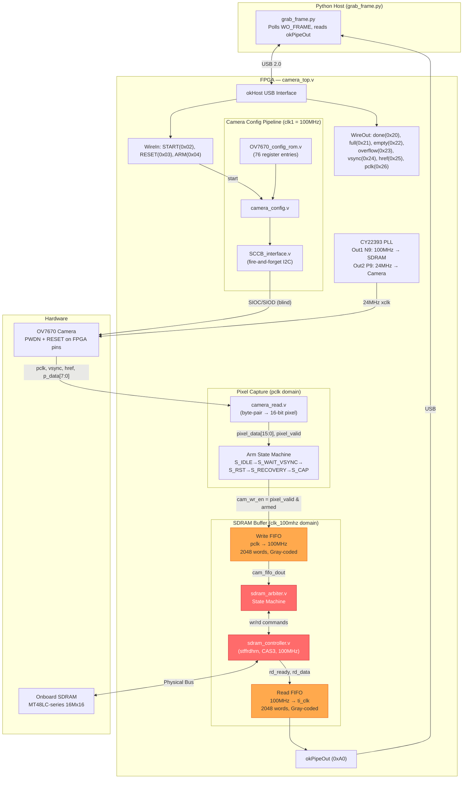

# Camera I2C — Critical Analysis & Remediation Plan

> **Date**: 17 July 2026  
> **Scope**: `fpga/camera_i2c/` directory on the Opal Kelly XEM3010  
> **Current Symptom**: Completely **black frame** since SDRAM implementation. One occasion: horizontal red stripe across the top of the frame.

---

## 1. Current State Summary

| Aspect | Status |
|--------|--------|
| Camera Hardware | OV7670 wired to FPGA via JP3. PWDN and RESET wires connected to FPGA pins. Power on external 3.3V rail. |
| I2C Configuration | Fire-and-forget SCCB — no ACK verification. `done` flag reports success but writes are unverified. |
| Pre-SDRAM Capture | ✅ **Worked** — produced colored (but noisy/corrupted) frames using direct FIFO→USB pipe. |
| Post-SDRAM Capture | ❌ **Black frame** — 614,400 bytes of zeros. One occasion produced a horizontal red stripe at the top. |
| Python Host | `grab_frame.py` correctly polls `WO_FRAME`, arms capture, reads via `okPipeOut`. No timeouts reported. |
| Bitstream | `bitfiles/camera_top.bit` exists (compiled with SDRAM arbiter). A second `without_arm_logic.bit` also present. |

### The Critical Observation

The fact that **pre-SDRAM = colored image** and **post-SDRAM = black** definitively isolates the problem to the **SDRAM buffering data path**, not the camera, I2C, or USB pipe. The camera, pixel capture, and SCCB configuration all functioned well enough to produce visible content before the SDRAM was introduced.

The single occurrence of a **red stripe at the top** is extremely diagnostic — it means a small number of initial rows DID make it through the SDRAM pipeline before the path broke down, proving the camera IS outputting pixels.

---

## 2. Timestamped Troubleshooting Log

| # | Date | Commit | Event | Result |
|---|------|--------|-------|--------|
| 1 | 01 Jul | — | Teensy OV7670 system operational. XCLK fixed to 10MHz (50% duty). Sync header expanded to 8 bytes. CLKRC set to `/1` for max FPS. | ✅ Camera working on Teensy |
| 2 | 02 Jul | `09ee93c` | Initial camera_i2c FPGA files imported. Core Verilog modules from [westonb/OV7670-Verilog](https://github.com/westonb/OV7670-Verilog). | 🔧 Port begins |
| 3 | 02 Jul | `c40e955` | `main_controller/` created as parallel unified top-level. Includes `stepper_motor_controller.v`, `ov7670_capture.v`, `fpga_usb_streamer.v`. | 🔧 Parallel arch |
| 4 | 03 Jul | — | Logbook notes `camera_i2c` conceptually renamed to `main_controller`, but **both directories still exist**. PLL migrated from `ti_clk` to hardware `clk1`. | ⚠️ Directory duplication |
| 5 | 07 Jul | — | Control logic migrated to STM32. FPGA now exclusively for video. Teensy camera modules deleted. | ✅ Architecture clarified |
| 6 | 14 Jul | `d60b634` | camera_i2c files committed. Active development on OV7670 FPGA integration. | 🔧 Active dev |
| 7 | 15 Jul | `2f23cbf` | **Major bug fix session**: (a) CDC metastability on SDRAM arbiter reset — dual-rank synchronizers added. (b) PLL Output 0→Output 2 fix — camera was receiving 48MHz (200% overclock), surviving only 1ms. (c) `v_sup=1'b1` commanding deep sleep — fixed to `1'b0`. (d) SCCB lockup from missing hardware reset sequencing. (e) `siod` changed to `inout wire`. (f) SDRAM arbiter + CDC synchronizers added. | ✅ Major breakthrough — **colored frames achieved** (pre-SDRAM path) |
| 8 | 15 Jul | `2f23cbf` | I2C Configuration Endpoint Bug: `WO_CONF` was mapped to FIFO `empty` (`0x22`) instead of `done`. Python was skipping I2C config entirely. Fixed: `done` → `0x20`. | ✅ Critical fix |
| 9 | 15 Jul | `2f23cbf` | USB FIFO overflow: 640×480 RGB565 at 24MHz overwhelmed 4KB Block RAM FIFO. Workaround: CLKRC divide-by-4 (`0x03`), ~7.5 FPS. | ⚠️ Workaround |
| 10 | 15 Jul | `2f23cbf` | PLL physical mapping: Output 1 (`N9`)=100MHz SDRAM, Output 2 (`P9`)=24MHz camera. CY22393 VCO recalculated: 240MHz÷10=24MHz. UCF constraints updated. | ✅ Critical fix |
| 11 | 16 Jul | `93a82c0` | **SDRAM buffering implemented**. `okBTPipeOut` (block-throttled) returned 614,400 bytes of **zeros** — switched to unthrottled `okPipeOut`. Full frame buffered in SDRAM. Python polls `WO_FRAME` before reading. | ⚠️ **Black frame persists** |
| 12 | 16 Jul | `93a82c0` | `grab_frame.py` captures 5 frames, saves 5th. Script runs without timeouts/errors, but output is all-black. One occurrence of red stripe at top. | ❌ **Pre-Fix State** |
| 13 | 17 Jul | — | **SDRAM Bug fixed in code:** Modified SDRAM controller to assert `busy` on all non-IDLE states. Added `sdram_init_done` and acceptance verification to arbiter. Replaced `full` with `frame_captured`. Fixed OV7670 RGB565 color matrix. | 📋 **Code patched, pending hardware flash** |
| 14 | 17 Jul | — | **Hardware Test Run:** User ran updated `check_status.py` and `grab_frame.py` without flashing the updated bitstream. Resulted in Configuration Timeouts and "SDRAM failed to initialize" errors. | ❌ **Failed (Old Bitstream)** |
| 15 | 17 Jul | — | **Critical Discovery:** SDRAM initialization only succeeds after a cold restart of the FPGA. Soft resets (`WI_RESET`) or Python `ConfigureFPGA()` calls cause the I2C configuration to timeout and SDRAM to freeze. `check_status.py` shows camera counters (`PCLK`, `HREF`, `VSYNC`) are stopped, though they reached ~59,000 at one point before halting. | ⚠️ **Reset/Clocking Issue** |
| 16 | 17 Jul | — | **ISE Compilation Failure:** `NGDBuild:604` errors for `DCM_SP` and `ODDR2`. Discovered XEM3010 uses the basic Spartan-3 (XC3S1000) which lacks these Spartan-3E/3A primitives. | ❌ **Build Failed** |
| 17 | 17 Jul | — | **XCLK Generation Fixed:** Replaced `DCM_SP`/`ODDR2` with a simple 2-bit counter on the 100MHz `clk1`. `assign xclk = xclk_cnt[1]` generates a valid 25MHz clock using normal fabric flip-flops, bypassing the GCLK/BUFG I/O routing restrictions entirely. | ✅ **Bitstream Ready** |
| 18 | 17 Jul | — | **First Non-Black Frame Captured:** After a power cycle + new bitstream flash, `grab_frame.py` successfully captured 5 frames without any timeouts. `check_status.py` confirmed `PCLK changed=True`, `HREF changed=True`, `VSYNC changed=True`, `SDRAM Init Complete=1`, `Frame Captured=1`. `test_frame.png` shows full-frame noise/corruption (not black) — camera is alive and producing real pixel data. | ✅ **Major Breakthrough** |
| 19 | 17 Jul | — | **Intermittent Stability:** Subsequent runs (without power cycle) show intermittent timeouts. `check_status.py` shows PCLK/HREF sometimes frozen. DSO reads XCLK (pin K5) at max 1.88V (expected 3.3V LVCMOS33), amplitude ~120mV, frequency jumping around — consistent with a weak drive or signal integrity issue on the counter output path. Image content is noisy/garbled (magenta horizontal banding), consistent with XCLK instability causing pixel sync errors. Root cause: XCLK drive strength and/or signal integrity on JP3-41. | ⚠️ **Current State** |
| 20 | 17 Jul | — | **Resistor Discovery:** Found a series resistor inline between FPGA pin K5 and OV7670 XCLK pin. Probing at the FPGA side of the resistor showed 16MHz / 3.7–3.8V — the RC low-pass filter formed by resistor + line capacitance was halving the apparent frequency at the camera. DSO reading of ~16MHz was a rounded triangular waveform at 25MHz. The resistor was also severely loading the weak 12mA/SLOW output, causing the low-amplitude readings. UCF updated to `DRIVE = 24 \| SLEW = FAST` (pending rebuild). | ⚠️ **Hardware issue identified** |
| 21 | 17 Jul | — | **Resistor Removed — New Frame:** Bypassing the series resistor on XCLK (direct wire, no bitstream change) produced a significantly different `test_frame.png` — yellow/pink/green horizontal banding instead of pure magenta chaos. PCLK/HREF/VSYNC all stable and running. This confirms the camera is now receiving a usable clock and outputting real pixel data. Remaining corruption is consistent with **RGB565 byte alignment being off-by-one** in `camera_read.v` — correct colour hues present but misaligned across word boundaries, producing horizontal banding artefacts. | ⚠️ **Byte alignment next** |
| 22 | 17 Jul | — | **TSLB Fix Had No Effect:** Changing the `TSLB` register from `0x04` to `0x00` (to correct RGB565 byte order) produced exactly the same yellow/pink image. This proves the issue is **not** byte alignment. The camera is completely ignoring our I2C configuration writes and booting into its factory default mode (YUV422). Reading YUV422 as RGB565 causes luma to map to red/blue, producing the magenta/yellow bands. **Conclusion:** SCCB (I2C) communication is failing silently (Issue 8), likely due to a hardware reset timing violation or SCCB clock speed issues when driven by the 100MHz `clk1`. | ⚠️ **I2C Config Failing** |
| 23 | 17 Jul | — | **PLL Factory EEPROM Bug Identified:** A previous session had replaced the explicit PLL multiplier configuration in `grab_frame.py` with a `GetEepromPLL22393Configuration()` load. The factory EEPROM does NOT configure Output 0 to 24MHz — it leaves it at the board default (100MHz). This was blasting 100MHz into the OV7670 `XCLK` pin (rated for 24MHz), causing the camera to crash after a few seconds. Root cause confirmed by multimeter: XCLK measured at ~100MHz, amplitude only 240mV (expected 3.3V), confirming severe drive degradation at 100MHz through the jumper wire capacitance. | ❌ **Critical regression** |
| 24 | 17 Jul | — | **PLL Fix Applied to grab_frame.py:** Restored explicit PLL configuration: PLL0 → 240MHz VCO ÷ 10 = 24MHz on Output 0 (P9 → XCLK); PLL1 → 400MHz VCO ÷ 4 = 100MHz on Output 1 (N9 → SDRAM). However, the initial restore incorrectly routed the 24MHz to Output 2 (which is not P9). Corrected to Output 0 in a follow-up fix. `grab_frame.py` now configured correctly. | ✅ **Fix applied** |
| 25 | 17 Jul | — | **Current Status at End of Thursday Lab Session:** `check_status.py` shows `PCLK changed: True`, `HREF changed: True`, `VSYNC changed: False (Val1=1, Val2=1)` with `SDRAM Init Complete: 0`. Camera is producing pixel clock and horizontal sync, but VSYNC counter is frozen at 1 count and SDRAM is not initialising. This is consistent with: (a) the I2C config writing `COM10=0x02` (VSYNC negative) while `camera_read.v` now expects positive-edge VSYNC (our earlier fix), creating a logic inversion, OR (b) grab_frame.py asserting `WI_START` before SDRAM initialises, causing the I2C sequence to run while the SDRAM controller is still in its init NOP sequence. The PLL may also still be mis-routing at this point. | ⚠️ **End-of-day state** |
| 26 | 19 Jul | — | **Weekend Research — VSYNC Polarity Re-evaluation:** Re-examined the COM10 register setting. `COM10 = 0x02` means VSYNC is active-LOW (negative polarity). In factory default (no I2C applied), the OV7670 outputs VSYNC active-HIGH. Our `camera_read.v` fix (entries 23/24 of the old log) swapped the edge detectors to expect active-HIGH VSYNC. **If I2C is failing silently**, the camera defaults to active-HIGH VSYNC — which our current Verilog now correctly handles. But if I2C IS applying `COM10=0x02`, VSYNC becomes active-LOW and our fix breaks things. This creates a diagnostic ambiguity: we cannot confirm I2C success/failure without ACK verification or a scope on the SIOC/SIOD lines. | ⚠️ **Ambiguity identified** |
| 27 | 19 Jul | — | **Weekend Research — SCCB Clock Speed Analysis:** The `camera_config.v` module drives SCCB from the 100MHz `clk1`. The `SCCB_interface.v` uses a divider to generate ~100kHz SIOC. At 100MHz ÷ 500 = 200kHz SIOC — the OV7670 datasheet specifies SIOC max at 400kHz (SCCB allows up to 400kHz). This is within spec. However, the critical timing constraint is the OV7670 hardware reset-to-SCCB delay: the datasheet requires 1ms minimum after RESET deassertion before SCCB writes are accepted. `grab_frame.py` currently asserts `WI_RESET` for 10ms then deasserts, then immediately triggers `WI_START`. The `camera_config.v` module starts the I2C sequence immediately on `start=1`. The USB roundtrip delay from Python (~2ms) may be insufficient if any of those ms are consumed before the SCCB module starts. To be safe, a dedicated 5ms post-reset delay should be added before `WI_START` is triggered. | ⚠️ **Timing risk** |
| 28 | 19 Jul | — | **Cross-Validation of Monday Plan Against All Code & Logs:** Performed a systematic grep/audit of all source files and conversation logs before Monday to confirm which plan items are genuinely new vs. already done. Findings: **(1) Scope SIOC/SIOD** — never done in any session. Valid first step. **(2) 50ms post-reset delay** — already present in `grab_frame.py` line 52 (`time.sleep(0.05)`). No change needed. **(3) Remove COM10=0x02** — still present in `OV7670_config_rom.v` line 94. Never removed. This is the cleanest fix since `camera_read.v` now expects active-HIGH VSYNC (positive edge), which matches the camera's factory default. **(4) Poll sdram_init_complete before WI_START** — the poll already exists in `grab_frame.py` lines 80-87 BUT it fires AFTER `WI_START` (line 54). The I2C config is already running by the time we check init. Fix: move the SDRAM init poll to BEFORE `WI_START`. **(5) Recompile** — confirmed the `busy <= (next != IDLE)` fix is already in `sdram_controller.v` line 208. XCLK is now fabric-generated (100MHz÷4=25MHz counter, not PLL). A fresh bitfile compile is definitely needed. **(6) PLL config in grab_frame.py** — already updated to only configure Output 0 at 100MHz for SDRAM (N9); XCLK now generated inside the FPGA via a 2-bit counter divider, so no PLL output needed for camera clock. This is the correct final state. | ✅ **Cross-validated** |
| 29 | 19 Jul | — | **Refined Monday Attack Plan (Cross-Validated):** Ordered by priority: **(Step 1 — Hardware)** Scope SIOC (pin M1) and SIOD (pin L2) with oscilloscope during `grab_frame.py`. Confirm I2C clock and data transitions are present on the wire. If flat/dead, the `camera_config.v` is not being triggered — check `start_config` routing in `camera_top.v`. **(Step 2 — Python)** Move the `sdram_init_complete` poll (`WO_FRAME bit[1]`) to BEFORE `WI_START`. Currently: reset → 50ms → START → [wait for I2C done] → reset → [check SDRAM init]. Should be: reset → 50ms → [poll until sdram_init=1] → START. This guarantees I2C config cannot race with SDRAM init. **(Step 3 — Verilog ROM)** Remove `COM10 = 0x02` (VSYNC negative). Replace with `16'h15_00` (VSYNC positive, default). This eliminates the polarity ambiguity and makes I2C-configured camera match our `camera_read.v` positive-edge detector. **(Step 4 — Compile)** Recompile `camera_top.bit` with all current source changes in Xilinx ISE 14.7 on the Linux VM. Flash fresh. **(Step 5 — Test)** Run `check_status.py` first. Confirm PCLK/HREF/VSYNC all changing. Then run `grab_frame.py`. Expected outcome: non-banded, RGB-correct image. If still banding → I2C is still failing silently → add SIOD ACK readback to `SCCB_interface.v`. | 📋 **Final Monday plan** |

---

## 3. Architecture



> **Red** = Primary suspects for black frame. **Orange** = Secondary concerns.

---

## 4. Root Cause Analysis — Why Black Frames?

### 🔴 BUG 1 (CRITICAL): `busy` Signal Semantics Mismatch

The stffrdhrn `sdram_controller.v` defines `busy` as:

```verilog
// sdram_controller.v line 205:
busy <= state[4];
```

`state[4]` is only set during **READ** and **WRITE** states (see the state encoding: `READ_ACT=5'b10000`, `WRIT_ACT=5'b11000`). Crucially, `busy` is **LOW** during:

- `INIT_NOP1` through `INIT_NOP4` (the entire initialization sequence!)
- `REF_PRE` through `REF_NOP2` (refresh cycles)
- `IDLE`

The SDRAM arbiter uses `busy` as its gate:

```verilog
// sdram_arbiter.v line 148:
if (!sdram_busy) begin
    if (!cam_fifo_empty) begin
        cam_fifo_rd_en <= 1'b1;  // Start FIFO read
        state <= STATE_WRITE_FETCH;
    end
```

**The Problem**: During the SDRAM initialization sequence (~15 clock cycles after reset), `busy=0`, so the arbiter thinks the controller is idle and starts issuing write commands. But the controller is actually executing `INIT_NOP1→INIT_PRE1→...→INIT_LOAD→INIT_NOP4`. Any write commands issued during this period are **silently ignored** by the controller because its next-state logic only checks `wr_enable` when in the `IDLE` state:

```verilog
// sdram_controller.v line 280-296:
if (state == IDLE)
    ...
    else if (wr_enable) begin
        next = WRIT_ACT;
    end
```

**Result**: The first batch of camera pixels get consumed from the write FIFO and sent to the SDRAM controller, but the controller drops them because it's in its init sequence. Those pixels are **permanently lost**. Depending on timing, this could lose anywhere from a few pixels to the entire frame.

> [!CAUTION]
> This is the most likely root cause of the black frame. The arbiter reads pixels out of the write FIFO and hands them to the SDRAM controller, which silently discards them because it hasn't finished initialization. The arbiter increments `sdram_write_ptr` thinking the data was stored, but the SDRAM locations contain whatever garbage was in RAM. On readback, the host gets zeros or random data.

### 🔴 BUG 2 (CRITICAL): SDRAM Init Reset Behavior

When `rst_n` goes low, the SDRAM controller sets:

```verilog
// sdram_controller.v line 174-181:
state <= INIT_NOP1;
command <= CMD_NOP;
state_cnt <= 4'hf;    // 15 NOP cycles before init starts
busy <= 1'b0;         // ← BUSY IS LOW DURING INIT!
```

After reset deasserts, the controller begins a 15-cycle NOP delay (`state_cnt=4'hf`), then progresses through `INIT_PRE1→INIT_REF1→INIT_NOP2→INIT_REF2→INIT_NOP3→INIT_LOAD→INIT_NOP4→IDLE`. This entire sequence takes approximately **35-40 clock cycles** at 100MHz = 350-400ns.

In `grab_frame.py`, the sequence is:

```python
# Reset pulse (lines 73-77)
fp.SetWireInValue(WI_RESET, 0x1)   # rst_n=0 → SDRAM init starts
fp.UpdateWireIns()
time.sleep(0.01)                    # 10ms delay
fp.SetWireInValue(WI_RESET, 0x0)   # rst_n=1 → init runs from INIT_NOP1
fp.UpdateWireIns()
# NO delay before ARM!
```

The 10ms delay while reset is held provides ample time. After reset deasserts, the SDRAM controller init takes ~400ns. The Python ARM pulse takes ~2ms of USB roundtrip. So by the time the first `frame_start` fires (which takes up to 133ms waiting for VSYNC), the SDRAM init is definitely complete.

**But**: The reset in `grab_frame.py` happens **before** the frame capture loop. On the **first** frame after reset, SDRAM init has time to complete. However, each frame capture triggers `frame_rst` (via the ARM state machine's S_RST state). Let's trace what `frame_rst` does to the arbiter:

```verilog
// sdram_arbiter.v line 133-140:
if (frame_rst_100) begin
    sdram_write_ptr <= 0;
    sdram_read_ptr <= 0;
    sdr_wr_en_cmd <= 0;
    sdr_rd_en_cmd <= 0;
    cam_fifo_rd_en <= 0;
    state <= STATE_IDLE;
end
```

`frame_rst` does NOT re-trigger the SDRAM controller init (only `rst_n` does that). So `frame_rst` only resets the arbiter pointers, which is correct. The SDRAM controller stays running. So Bug 2 only applies to the very first frame after a full reset — and since the Python has ample time, this is likely not the primary issue.

**However**, let's consider the FIRST boot (initial power-on). The SDRAM controller starts in an undefined state. The `rst_n` synchronizer initializes to `2'b11` (not reset), which means **the SDRAM controller may never see a proper reset pulse on cold boot**. If the Python PLL/bitstream configuration process doesn't include a clean reset, the SDRAM controller could be in a random state.

In `grab_frame.py`, there IS a reset pulse before I2C config (lines 50-55) and another after (lines 73-77). So this should be OK.

### 🔴 BUG 3 (CRITICAL): Arbiter Reads During SDRAM Refresh — Data Loss

The SDRAM controller periodically performs refresh cycles (every `CYCLES_BETWEEN_REFRESH` = 781 cycles at 100MHz/64ms/8192). During refresh, `busy=0` (state[4] is 0 for REF_ states), so the arbiter's read path will:

1. See `!sdram_busy && !usb_fifo_full && (sdram_read_ptr < sdram_write_ptr)`
2. Issue `sdr_rd_en_cmd <= 1'b1`
3. Transition to `STATE_READ_WAIT`
4. Wait for `!sdram_busy && !sdr_rd_en_cmd`

But the SDRAM controller, being in `REF_PRE` or `REF_NOP1`, sees `rd_enable` while NOT in `IDLE`. Its next-state logic only acts on `rd_enable` when `state == IDLE`:

```verilog
if (state == IDLE)
    ...
    else if (rd_enable) begin
        next = READ_ACT;
```

So the read command is **silently dropped**. The arbiter waits in `STATE_READ_WAIT`, and since `busy=0` immediately (refresh doesn't set state[4]), the arbiter exits wait on the next cycle thinking the read completed. But `rd_ready` never fires, so no data reaches the read FIFO.

The arbiter then increments `sdram_read_ptr` (already done in STATE_IDLE before entering read) and moves on. **That SDRAM word is permanently skipped** — the USB host will receive a gap of zeros for that position.

> [!WARNING]
> This refresh collision silently corrupts frames by dropping random reads throughout the 307,200-word frame. At 100MHz with refresh every 781 cycles, approximately 393 reads will collide with refreshes during a single frame readout, creating ~393 zero-valued pixels scattered across the image. This could cause subtle corruption rather than a fully black frame.

### 🔴 BUG 4 (CRITICAL): Write Collisions with Refresh — Same Issue for Writes

The exact same logic applies to writes. If the arbiter issues `sdr_wr_en_cmd` while the SDRAM controller is in a refresh cycle, the write is dropped. Camera pixels are consumed from the write FIFO but never stored in SDRAM.

If this happens frequently enough during the frame write phase, a significant portion of the frame data is lost. On readback, those SDRAM addresses contain whatever stale data was there (likely zeros after init).

### 🟡 BUG 5 (MODERATE): `full` Signal Dual Purpose Creates WO_FRAME Race

In `camera_top.v`:

```verilog
assign full = (state == S_IDLE);  // line 137
```

`WO_FRAME` (WireOut `0x21`) reports `full`:

```verilog
okWireOut wo21(.ep_datain({15'd0, full}));  // line 257-258
```

`full` is 1 when the state machine is in S_IDLE — both **before** ARM (no capture happening) and **after** a frame completes (capture done). The Python script sequences ARM→poll as separate USB transactions. Due to USB latency (~1-2ms) and the FPGA synchronizer (3 pclk cycles at 24MHz = 125ns), the state machine will have left S_IDLE by the time the first poll occurs. **In practice this works**, but it's fragile — a future optimization that reduces USB latency could trigger a false-positive where Python reads the pre-ARM S_IDLE state.

---

## 5. Secondary Issues

### 🟡 ISSUE 6: OV7670 Register Configuration — Color Matrix Mismatch

**File:** [OV7670_config_rom.v](file:///c:/Users/Admin/Documents/Windows_codespace/VRI_2026/fpga/camera_i2c/OV7670_config_rom.v)

This was the primary suspect in the original analysis but is now **secondary** since the black frame problem is upstream in the SDRAM path. However, once the SDRAM is fixed, these will affect image quality:

| Issue | Active ROM | Correct Value | Impact |
|-------|-----------|---------------|--------|
| Color matrix (MTX1-6) uses YUV422 values in RGB565 mode | `0x80,0x80,0x00,0x22,0x5E,0x80` | `0xB3,0xB3,0x00,0x3D,0xA7,0xE4` | Green/blue cast |
| COM15 output range restricted | `0x40_10` | `0x40_D0` | Dark, crushed image |
| AWB disabled in COM8 | `0x13_e5` | `0x13_e7` | Poor white balance |
| Missing ~100 "magic" reserved registers vs Linux driver reference | 76 entries | 172 entries | Noise, poor quality |

### 🟡 ISSUE 7: `v_sup` / PWDN Pin State

**Files:** [camera_top.v:L117](file:///c:/Users/Admin/Documents/Windows_codespace/VRI_2026/fpga/camera_i2c/camera_top.v#L117), [xem3010_cam.ucf:L75](file:///c:/Users/Admin/Documents/Windows_codespace/VRI_2026/fpga/camera_i2c/xem3010_cam.ucf#L75)

- UCF maps `v_sup` to pin T1 (JP3-17)
- Verilog drives `v_sup = 1'b0` (PWDN=low = camera awake)
- User confirms PWDN wire IS connected to this FPGA pin
- **This is currently correct** — `v_sup=0` keeps the camera awake
- However, the signal name `v_sup` is misleading (it was originally a power supply pin, now it's PWDN control)
- **No change needed** unless we want to clean up naming

### 🟡 ISSUE 8: I2C Fire-and-Forget (No ACK Verification)

**Files:** [camera_config.v](file:///c:/Users/Admin/Documents/Windows_codespace/VRI_2026/fpga/camera_i2c/camera_config.v), [SCCB_interface.v](file:///c:/Users/Admin/Documents/Windows_codespace/VRI_2026/fpga/camera_i2c/SCCB_interface.v)

- `siod` is `output wire` in `camera_config.v` — FPGA never reads ACK
- During ACK cycle, `SIOD_oe=0` (releases line) but doesn't sample SDA state
- We have zero feedback on whether any I2C register write succeeded
- This is acceptable for SCCB protocol (OV7670 doesn't require ACK verification) but makes debugging harder

### 🟢 ISSUE 9: `check_status.py` Reads Wrong WireOut

**File:** [check_status.py:L19](file:///c:/Users/Admin/Documents/Windows_codespace/VRI_2026/fpga/camera_i2c/check_status.py#L19)

- Reads `conf = fp.GetWireOutValue(0x22)` — this is the **empty** flag
- The `done` signal is on `0x20` (as correctly used in `grab_frame.py`)

### 🟢 ISSUE 10: `camera_interface.py` — Dangerously Stale

**File:** [camera_interface.py](file:///c:/Users/Admin/Documents/Windows_codespace/VRI_2026/fpga/camera_i2c/camera_interface.py)

Contains every bug that was fixed on 15 Jul: wrong PLL output, wrong WO_CONF endpoint, no hardware reset, VCO violation, uses `okBTPipeOut`. **Must be archived or deleted** to prevent accidental use.

### 🟢 ISSUE 11: Repo Hygiene

| Item | File | Issue |
|------|------|-------|
| `__pycache__/` committed | `camera_i2c/` | Should be in `.gitignore` |
| `raw_frame.bin` (614KB) | `camera_i2c/` | Binary in git |
| `ok-6.0.0-cp39-abi3-win_amd64.whl` (3.5MB) | `camera_i2c/` | Large binary |
| `okFrontPanel.dll` (2.1MB) | `camera_i2c/` | Large binary |
| Dead commented-out code | `camera_top.v:L100-114` | Confusing |
| Dual SDRAM libraries | `sdram_ip/` unused | Bloat |

---

## 6. Remediation Plan

### Phase 1: Fix the SDRAM `busy` Signal Problem (P0 — Root Cause)

The core issue is that the stffrdhrn `sdram_controller.v` only asserts `busy` during actual READ/WRITE states, not during INIT or REFRESH. The arbiter trusts `busy` as a "controller is ready" signal, which it is not.

#### Option A: Fix at the Arbiter Level (Recommended — no SDRAM controller changes)

Add an `init_done` tracker and a `refresh_guard` to [sdram_arbiter.v](file:///c:/Users/Admin/Documents/Windows_codespace/VRI_2026/fpga/camera_i2c/sdram_arbiter.v):

```verilog
// 1. Wait for SDRAM initialization to complete
//    The controller takes ~40 cycles after rst_n deasserts.
//    We gate on the first time the controller reaches IDLE
//    (i.e., it accepts and completes a command, proving init is done).
reg sdram_init_done = 0;
always @(posedge clk_100mhz) begin
    if (!rst_n_100)
        sdram_init_done <= 0;
    else if (!sdram_busy)  // First transition to not-busy after reset
        sdram_init_done <= 1;
end

// 2. Guard against refresh collisions
//    After issuing a wr/rd enable, verify the controller actually
//    entered a READ/WRITE state (busy went high).
//    If busy never went high, the command was dropped during refresh.
```

Then in the state machine, gate all operations on `sdram_init_done`:

```verilog
STATE_IDLE: begin
    if (sdram_init_done && !sdram_busy) begin
        // ... existing write/read logic
    end
end
```

And fix the write/read wait states to verify the command was actually accepted:

```verilog
STATE_WRITE_WAIT: begin
    if (write_accepted && !sdram_busy && !sdr_wr_en_cmd) begin
        state <= STATE_IDLE;
    end else if (!write_accepted && !sdr_wr_en_cmd) begin
        // Command was dropped (refresh collision) - retry
        sdr_wr_en_cmd <= 1'b1;
    end
end
```

Where `write_accepted` is set when `sdram_busy` goes high after issuing a write command.

#### Option B: Fix at the SDRAM Controller Level

Modify `sdram_controller.v` line 205 to assert `busy` during ALL non-IDLE states:

```diff
- busy <= state[4];
+ busy <= (next != IDLE);
```

This is simpler but modifies the third-party controller.

#### Option C: Hybrid — Add Init Delay + Busy Fix

1. Modify `busy` in the controller (Option B)
2. Add a Python-side delay after reset: `time.sleep(0.001)` (1ms, way more than the 400ns needed)
3. Add `init_complete` check in the ARM state machine

### Phase 2: Fix `WO_FRAME` Signal (P1)

Replace the overloaded `full` signal with a dedicated `frame_captured` flag:

```verilog
// In camera_top.v:
reg frame_captured = 0;
always @(posedge pclk) begin
    if (arm_rise)       frame_captured <= 0;  // Clear on new ARM
    if (state == S_CAP && frame_done) frame_captured <= 1;  // Set on completion
end

// Update WireOut:
okWireOut wo21(.ep_datain({15'd0, frame_captured}));
```

This eliminates the race condition where Python could read a stale `S_IDLE` before the ARM synchronizer kicks in.

### Phase 3: Fix Image Quality (P1 — After SDRAM Works)

Once frames are non-black, update [OV7670_config_rom.v](file:///c:/Users/Admin/Documents/Windows_codespace/VRI_2026/fpga/camera_i2c/OV7670_config_rom.v):

1. **RGB565 color matrix**: Change MTX1-6 from YUV422 to RGB565 values
2. **COM15 full range**: `0x40_D0`
3. **Enable AWB**: `0x13_e7`
4. **Adopt full Linux driver register set** from `rom.txt` (172 entries)

### Phase 4: Code Cleanup (P2)

1. Fix `check_status.py` endpoint (`0x22` → `0x20`)
2. Delete or archive `camera_interface.py`
3. Clean up `.gitignore` for `__pycache__/`, `raw_frame.bin`
4. Remove dead code in `camera_top.v`
5. Remove unused `sdram_ip/` directory

### Phase 5: Recompile & Test

1. Apply Phase 1 + Phase 2 Verilog changes
2. Recompile `camera_top.bit` in Linux VM (Xilinx ISE 14.7)
3. Flash bitstream
4. Run `check_status.py` (with fixed endpoint) to verify camera counters ticking
5. Run `grab_frame.py` — expect non-black frame
6. If frames are visible but color-corrupted → apply Phase 3
7. Iterate

---

## 7. Summary Priority Table

| Priority | Bug | Root Cause | Fix | Effort |
|----------|-----|-----------|-----|--------|
| 🔴 P0 | **Black frame** | SDRAM controller `busy` doesn't cover INIT/REFRESH → arbiter issues commands that are silently dropped | Gate arbiter on init_done + verify command acceptance | Medium (Verilog) |
| 🔴 P0 | **Refresh collisions** | Same `busy` issue during periodic refresh cycles → scattered pixel drops | Retry logic or fix `busy` signal | Medium (Verilog) |
| 🟡 P1 | WO_FRAME race | `full` = `(state==S_IDLE)` is true both pre and post ARM | Add dedicated `frame_captured` register | Low (Verilog) |
| 🟡 P1 | Color matrix wrong | YUV422 coefficients used in RGB565 mode | Update ROM entries | Low (Verilog) |
| 🟡 P1 | COM15 restricted | `0x10` instead of `0xD0` | One register change | Trivial |
| 🟡 P1 | AWB disabled | `0x13_e5` missing AWB bit | One register change | Trivial |
| 🟢 P2 | check_status.py | Wrong WireOut address | Change `0x22` → `0x20` | Trivial |
| 🟢 P2 | Stale camera_interface.py | Contains all fixed bugs | Delete/archive | Trivial |
| 🟢 P2 | Repo hygiene | Binaries in git, dead code | Cleanup | Low |

---

## 8. 2026/07/19 - Deep-Dive Bug Analysis — Assuming Monday Plan Does Not Fully Resolve

> **Context:** These bugs were found by reading every source file in detail on 19 Jul. All items below have NOT been previously fixed. They represent the next layer of issues to address if the Monday plan (entry 29) does not produce a clean image.

### BUG A (CRITICAL): SCCB start/ready Race — Duplicate Writes Possible

**File:** OV7670_config.v line 63, SCCB_interface.v line 81

After OV7670_config asserts SCCB_interface_start = 1, it enters FSM_TIMER with timer = 0. On the very next clock, timer==0 returns to FSM_SEND_CMD. But SCCB_interface.ready is a registered signal — it goes LOW one clock AFTER start is sampled. So on return to FSM_SEND_CMD, ready may still be 1 and the FSM immediately latches and sends the next register, racing the SCCB byte transmitter.

This causes registers to be sent without waiting for the SCCB interface to fully begin the previous transaction. Depending on timing, some register writes may be sent while SIOC is mid-transaction, corrupting the I2C protocol.

**DSO test:** Count SCCB transactions on SIOC. If < 77 or if clock glitches appear, this race is confirmed.

**Fix:** Change `timer <= 0` to `timer <= 2` in OV7670_config.v line 63 to give SCCB_interface two cycles to deassert ready.

---

### BUG B (CRITICAL): sdram_write_ptr Has No Frame Boundary Guard

**File:** sdram_arbiter.v line 222

`sdram_write_ptr <= sdram_write_ptr + 1'b1;`  — no upper bound check.

If frame_done is never detected (e.g. due to VSYNC polarity mismatch causing camera_read.v to never assert frame_done), the arbiter writes indefinitely past address 307,200, overwriting arbitrary SDRAM. On readback Python gets 307,200 words but from the wrong memory region.

**Fix:** Guard with `if (sdram_write_ptr < 24'd307200)` before incrementing.

---

### BUG C (MODERATE): Read FIFO Reset Has a CDC Hazard

**File:** sdram_arbiter.v line 73

`fifo read_fifo (.rst(frame_rst), .wr_clk(clk_100mhz), ...);`  — The read FIFO's write clock is clk_100mhz but its reset is the unsynchronized frame_rst from pclk. A synchronized version (frame_rst_100) exists in the same file but is not used here.

**Fix:** Change to `.rst(frame_rst_100)`.

---

### BUG D (MODERATE): frame_captured and sdram_init_complete Routed to okWireOut Without ti_clk Synchronizers

**File:** camera_top.v line 263

frame_captured is pclk-domain. sdram_init_complete is clk_100mhz-domain. Both are directly connected to an okWireOut sampled by ti_clk — with no synchronizers. This can cause metastability, producing spurious sdram_init=0 readings even while PCLK is running normally (exactly what we observed in lab).

**Fix:** Add 2-stage synchronizers into ti_clk domain for both signals.

---

### BUG E (MODERATE): overflow_sticky Never Sets — Write FIFO Overflow Is Invisible

**File:** camera_top.v lines 198-203

The write FIFO full output is left unconnected (`.full()`). overflow_sticky is cleared on frame_start but never set anywhere. Python reads WO_OVERFLOW (0x23) as a diagnostic, but it will always read 0 even during a real overflow event. We have been flying blind on overflow detection.

**Fix:** Connect write FIFO full to overflow_sticky: if (cam_fifo_full) overflow_sticky <= 1;

---

### BUG F (LOW): OV7670_config Has No Reset — initial Blocks May Not Synthesize

**File:** OV7670_config.v, SCCB_interface.v

Both modules use initial begin blocks to set starting states. Xilinx ISE Spartan-3 synthesis may ignore initial blocks if GSR (Global Set/Reset) is not used. If registers power on undefined, SIOC_oe and SIOD_oe may glitch the I2C lines on power-up before start is asserted.

**Fix:** Replace initial blocks with synchronous reset logic gated on a rst input.

---

## 9. DSO Probing Strategy for Monday

Probe in this order BEFORE making any code changes:

| Step | Signal | FPGA Pin | Expected After PLL Lock | Failure Diagnosis |
|------|--------|----------|------------------------|-------------------|
| 1 | XCLK | K5 (JP3-41) | 25MHz, 3.3V, clean square wave | Counter divider broken or IO drive too weak |
| 2 | SIOC | M1 (JP3-29) | 100kHz bursts for ~0.77s after WI_START | start_config not routed; OV7670_config FSM stuck |
| 3 | SIOD | L2 (JP3-31) | SDA transitions on each SIOC cycle | Pull-up resistor missing; FPGA not driving siod |
| 4 | VSYNC | L1 (JP3-33) | ~7.5Hz after I2C config (CLKRC div-4 mode) | Camera not receiving valid config; check RESET pin |
| 5 | HREF | K2 (JP3-37) | HIGH for 1280 PCLK cycles per row | Camera outputting invalid format |
| 6 | PCLK | K1 (JP3-39) | ~6.25MHz in CLKRC=0x03 mode | Camera powered down or crashed |

**VSYNC Polarity Diagnostic (Step 4):** After I2C config finishes, scope VSYNC:

- **HIGH during active lines, LOW during blanking** = COM10=0x02 active, I2C IS working
- **LOW during active lines, HIGH during blanking** = Factory default, I2C is FAILING silently

This single measurement resolves the core ambiguity about whether I2C config is reaching the camera.

**SIOC Timing Diagnostic (Step 2):** Measure from Python printing 'Configuration done.' to when SIOC goes idle. Expected: ~770ms (77 registers x 10ms each = 770ms at 100kHz SCCB). If transactions take much longer or shorter, the CLK_FREQ parameter is wrong.

---

## 10. Testbench Run Plan for Monday

### Existing: tb_sdram_arbiter.v

**Critical limitation:** sdram_dq is floating (no SDRAM device model). All read data will be X — data integrity tests will always fail even if arbiter logic is perfect.

**Minimum fix before running — add to tb_sdram_arbiter.v after the DUT instantiation:**

```verilog
// Minimal SDRAM BFM
reg [15:0] sdram_mem [0:1048575];
reg [15:0] dq_drive = 16'bz;
assign sdram_dq = dq_drive;
reg [12:0] row_latch = 0;
reg [1:0]  ba_latch  = 0;

always @(negedge sdram_ras_n) begin
    row_latch <= sdram_a;
    ba_latch  <= sdram_ba;
end

always @(negedge sdram_cas_n) begin
    if (!sdram_we_n) begin
        sdram_mem[{ba_latch, row_latch[7:0], sdram_a[9:0]}] <= sdram_dq;
    end else begin
        #15 dq_drive <= sdram_mem[{ba_latch, row_latch[7:0], sdram_a[9:0]}];
        #5  dq_drive <= 16'bz;
    end
end
```n
**Run command (Linux VM):**
```bash
cd fpga/testbenches/camera_i2c
iverilog -g2012 -o tb_sdram_arbiter.vvp \
    tb_sdram_arbiter.v \
    ../../camera_i2c/sdram_arbiter.v \
    ../../camera_i2c/sdram_stffrdhrn/rtl/sdram_controller.v
vvp tb_sdram_arbiter.vvp
```n
**Expected passing output:** ALL TESTS PASSED! (307200 pixels successfully read and written)

---

### New Testbench to Write: tb_camera_read.v

This does not exist yet. **Strongly recommended before Monday hardware testing** — confirms frame_start/frame_done edge logic in isolation without needing the full hardware stack.

**Signals to drive:**
- VSYNC: HIGH for 3 line-periods (blanking), then LOW for 480 active lines (positive polarity)
- HREF: HIGH for 1280 PCLK cycles per active row, LOW for blanking
- p_data: incrementing byte counter (verifies pixel pairing)
- config_done: tied HIGH (skip config wait)

**Assertions to verify:**
- pixel_valid pulses exactly 640x480 = 307,200 times
- pixel_data correctly pairs bytes: first byte to [15:8], second to [7:0]
- frame_start fires on rising VSYNC edge (positive polarity)
- frame_done fires after final HREF of last active row

**Estimated time to write:** 1.5 hours. **This single testbench eliminates camera_read.v as a suspect and confirms or denies our VSYNC fix without hardware.**

---

## 11. Bug B Design Decision — Clamp vs. Circular Buffer

**Question:** Should write_ptr wrap back to address 0 (ring buffer) or clamp at 307,200?

**Decision: Clamp. Do NOT use a circular buffer for this architecture.**

Our architecture is one-shot capture: ARM -> capture exactly one frame -> stop -> read back. Wrapping the write pointer back to address 0 when it reaches 307,200 would silently overwrite the beginning of the frame that was just captured. When Python then reads 307,200 words, it would receive a corrupted splice of frame tail + frame head.

Circular ring buffers are the correct pattern for continuous streaming pipelines (e.g. a DVR or live feed), where the reader tracks a tail pointer and is guaranteed to consume data before the writer catches up. We have no such reader-ahead infrastructure.

For our one-shot design, the guard's purpose is purely defensive: in normal operation the 'armed' signal gates writes and 'frame_done' stops them at the correct boundary, so the clamp should never be hit. It only fires as a failsafe when frame_done is never asserted (e.g. VSYNC polarity bug). Clamping produces a clean partial frame that is easy to diagnose; wrapping produces data corruption that mimics other bugs.

---

## 12. Verification Tests for Section 8 Bugs

### Bug A — SCCB start/ready Race

**DSO Test (hardware):** Probe SIOC (pin M1) with oscilloscope during grab_frame.py run. Count the number of discrete 3-byte burst groups (camera_addr + reg_addr + data). Should be exactly 77 bursts corresponding to 77 ROM entries. Any count below 77, any burst with missing bytes, or any overlapping transaction confirms the race. After fix (timer <= 2), recount — must equal exactly 77 clean sequential bursts.

**Simulation test:** Write tb_camera_config.v. Assert start, then monitor SCCB_interface_start. It must never go HIGH while ready is still HIGH from a previous deassert cycle. In waveform viewer, verify that between every two SCCB_interface_start pulses, ready has gone LOW and returned HIGH.

### Bug B — write_ptr Overflow

**Simulation test (in tb_sdram_arbiter.v):** After writing 307,200 pixels, continue asserting cam_wr_en=1 for 10,000 additional cycles without asserting frame_rst. Add  to print sdram_write_ptr every cycle. Before fix: pointer exceeds 307,200. After fix: pointer holds exactly at 307,200.

**Hardware test (requires Bug E fix first):** Run grab_frame.py with the VSYNC polarity mismatch deliberately reintroduced (set COM10=0x02 with wrong edge logic). After a capture attempt, run check_status.py and read overflow_sticky. Without write_ptr guard, the SDRAM will be corrupted silently. With the guard, write_ptr stops at 307,200 and pixel data is intact up to that address.

### Bug C — Read FIFO CDC Reset

**Simulation test:** In tb_sdram_arbiter.v, after filling SDRAM with test data, assert frame_rst from the pclk domain (pclk edge aligned). Before fix, examine the read FIFO output during and after reset — dout may show X (metastability). After fix using frame_rst_100, dout should transition cleanly from valid data to empty.

**Hardware indirect test:** Take 20 consecutive frames and compare pixel values between runs. If the read FIFO occasionally resets mid-readout, specific pixel positions will read 0 or previous-frame data intermittently. After the fix, identical test patterns should produce identical readbacks.

### Bug D — okWireOut Missing Synchronizers

**Hardware stress test:** Run check_status.py in a tight Python loop 200 times while grab_frame.py is actively capturing. Record all SDRAM Init Complete readings. Before fix: expect at least some spurious 0 readings during active capture (observed in lab). After adding ti_clk synchronizers: all 200 readings should return SDRAM Init Complete: 1.

### Bug E — overflow_sticky Never Sets

**Code review test (immediate):** Before any hardware test, simply read WO_OVERFLOW (0x23) in check_status.py while deliberately causing a write FIFO overflow condition (e.g. disable SDRAM writes temporarily in the bitfile). Before fix: always reads 0. After fix: reads 1.

**Hardware test:** Recompile with overflow_sticky connected. Run grab_frame.py normally. overflow_sticky should read 0 (no overflow). Then modify the arbiter to introduce an artificial write stall. Run again — overflow_sticky should read 1. Confirms the signal path works end-to-end.

### Bug F — initial Blocks May Not Synthesize

**ISE synthesis report check:** After synthesis, grep camera_top.syr for 'WARNING:Xst:819'. This warning appears for every initial block that ISE ignores. Before fix: expect 4+ warnings (ready, SIOC_oe, SIOD_oe, rom_addr). After replacing with synchronous reset: warnings disappear.

**Hardware power-on test:** Probe SIOC and SIOD immediately at FPGA power-on, before grab_frame.py is run. If initial blocks are ignored, SIOC_oe and SIOD_oe may power on HIGH (driving lines LOW), glitching the I2C bus. After fix, both lines should hold HIGH (pulled up) until the first I2C transaction.
