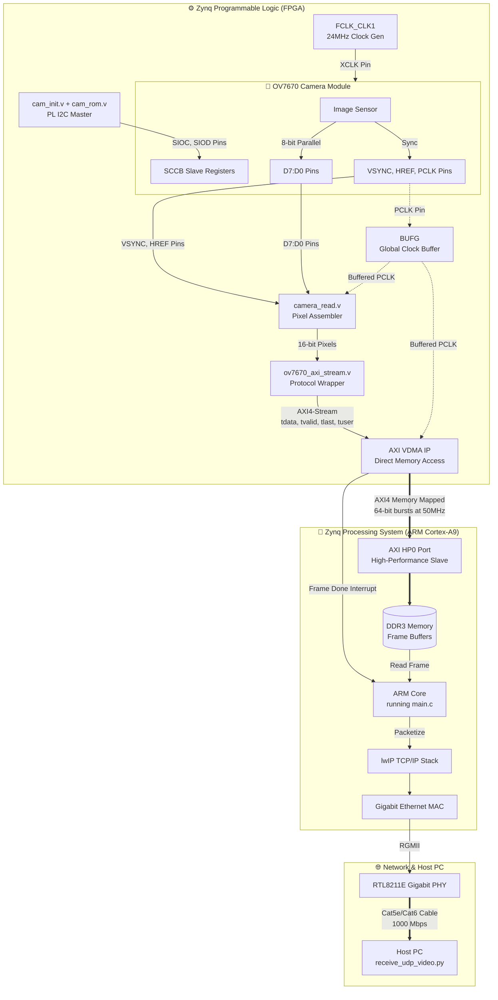

# OV7670 Camera Signal Chain & Pinout

This document outlines the entire hardware and software signal chain for the OV7670, tracking the journey of a single pixel from the camera sensor all the way to the display on your Host PC.

## Signal Flow Diagram

---

## The Journey of a Pixel (Step-by-Step)

### 1. Camera Initialization (I2C/SCCB)
Before anything happens, the camera needs to be configured.
* **Pins:** `SIOC` (Clock), `SIOD` (Data).
* **Process:** Inside the FPGA (Programmable Logic), `cam_init.v` reads a list of register values from `cam_rom.v` (like setting VGA resolution, RGB565 color format, etc.) and bit-bangs them over the `SIOC` and `SIOD` pins to the camera.
* **XCLK:** The camera needs a master clock to run its internal circuitry. The Zynq PS generates a 24MHz clock (`FCLK_CLK1`) and sends it out to the camera's `XCLK` pin.

### 2. Capturing the Pixels (Hardware)
Once configured, the camera starts blasting pixels continuously.
* **Pins:** `PCLK` (Pixel Clock), `VSYNC` (Frame Sync), `HREF` (Row Sync), `D[7:0]` (8-bit Data).
* **The Clock Buffer:** The incoming `PCLK` goes straight into a Global Clock Buffer (`BUFG`) inside the FPGA. This ensures the clock reaches all flip-flops simultaneously, preventing the timing violations (the `00014011` errors) we saw earlier.
* **Pixel Assembly:** `camera_read.v` monitors `VSYNC` to know when a frame starts. When `HREF` goes high, a row is active. Because the data is 8 bits wide but a pixel is 16 bits (RGB565), it takes two `PCLK` cycles to capture one pixel. `camera_read.v` grabs the high byte, waits for the low byte, and combines them into a 16-bit pixel.

### 3. AXI-Stream Conversion
The raw pixels need to be formatted so Xilinx standard IPs can understand them.
* **Module:** `ov7670_axi_stream.v`.
* **Process:** This module takes the 16-bit pixels and creates an **AXI4-Stream**. It generates `tvalid` (when a pixel is ready), `tlast` (at the 640th pixel to signal the end of the row), and `tuser` (on the very first pixel of the frame to signal Start of Frame).

### 4. Direct Memory Access (VDMA)
The ARM CPU is far too slow to read millions of pixels manually.
* **Module:** Xilinx AXI VDMA (Video Direct Memory Access).
* **Process:** The VDMA receives the AXI4-Stream. It contains an internal asynchronous FIFO to safely cross from the 24MHz camera clock domain to the 50MHz internal system clock domain. It packs the pixels into 64-bit bursts and blasts them through the High-Performance port (`HP0`) directly into the Zynq's DDR3 RAM.

### 5. Interrupt and Packetization (Software)
Once the VDMA writes exactly 480 rows (a full VGA frame) into DDR3, it fires a hardware interrupt to the ARM CPU.
* **File:** `main.c`.
* **Process:** The interrupt triggers your C code. The CPU pulls the freshly captured frame out of DDR3. It splits the massive 600+ KB frame into smaller ~1000-byte UDP packets so they can fit on the Ethernet network.
* **Network Stack:** The packets are handed to the `lwIP` (Lightweight IP) stack, which adds IP and UDP headers.

### 6. Transmission
* **Process:** The Zynq's internal Gigabit MAC takes the packets from `lwIP` and sends them via an RGMII interface to the physical PHY chip on the ZedBoard (RTL8211E). The PHY converts the digital signals into electrical pulses sent over the Cat5e/Cat6 Ethernet cable at 1000 Mbps to your Host PC.

### 7. Host PC Display
* **File:** `receive_udp_video.py`.
* **Process:** Your Python script listens on port `5000`. It receives the UDP packets out of order, uses the sequence numbers (frame ID and packet ID) you embedded in the C code to reassemble the frame, and then uses OpenCV to display the live video!
