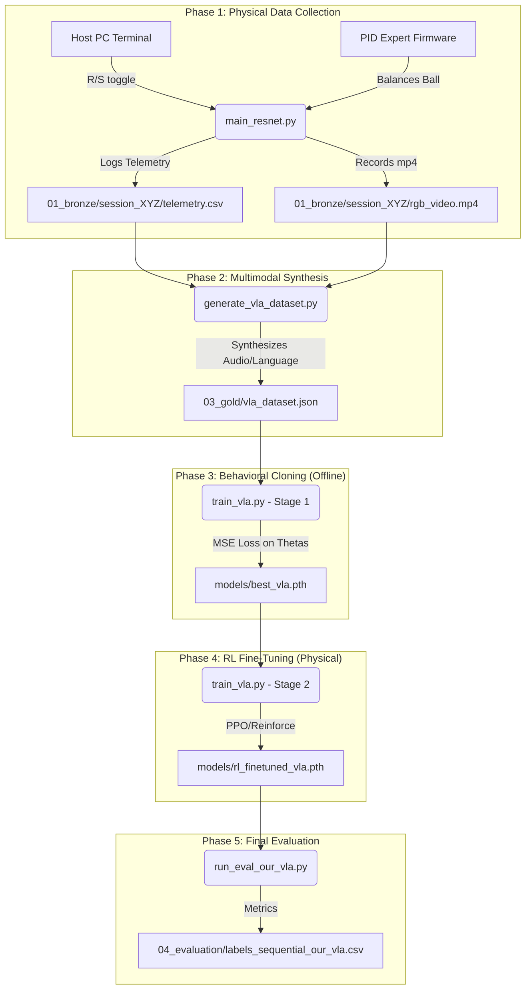

# VLA Data Collection & Training Pipeline

This document outlines the end-to-end lifecycle for collecting physical robot data, synthesizing multimodal datasets, training the Vision-Language-Action (VLA) model, and evaluating the final system.

## Pipeline Architecture

---

## Phase 1: Expert Demonstration Collection (Physical Robot)
To train the VLA, we first need to capture how the classical PID controller (The "Expert") responds to varying target coordinates.

*   **Mechanism:** The Arduino runs the `MLVisionControl` PID firmware. The Host PC dynamically tracks the colored markers on the platform.
*   **Recording Control:** To ensure data purity, recording is **manually toggled via the terminal** (e.g., pressing `R` to record, `S` to stop). This prevents capturing noisy initialization frames.
*   **Storage Architecture (`01_bronze`):**
    *   For extreme I/O efficiency, we avoid saving individual `.jpg` frames. 
    *   Instead, OpenCV `cv2.VideoWriter` records a highly compressed `rgb_video.mp4`.
    *   Simultaneously, we log telemetry (`target_x`, `target_y`, `touch_x`, `touch_y`, `theta_a`, `theta_b`, `theta_c`) into a `telemetry.csv` file.
    *   Crucially, the CSV contains a `frame_index` column, guaranteeing mathematical synchronization with the MP4.

## Phase 2: Multimodal Dataset Synthesis (Offline)
Raw coordinates and videos are useless to a language model. We must synthesize the multimodal format.

*   **Script:** `ml_multimodal/data_processing/generate_vla_dataset.py`
*   **Mechanism:** This script iterates through all valid sessions in `01_bronze/`. It maps target coordinates to synthetic **Language Tokens** (e.g., if the target matches the red marker's coordinates, it assigns the text `"go red"`).
*   **Output:** A unified, PyTorch-ready dataset located at `data/03_gold/vla_dataset.json` containing the schema: `[Image, Language_Command, State, Target_Thetas]`.

## Phase 3: Stage 1 Training - Behavioral Cloning (Offline)
We first teach the VLA to mimic the PID expert.

*   **Script:** `ml_multimodal/training/train_vla.py`
*   **Mechanism:** The `RT-1-Lite` neural network takes the image, text, and current state, and outputs predicted motor angles (`theta_a/b/c`).
*   **Loss:** A standard Mean Squared Error (MSE) loss function is used to force the network's predictions to match the expert's `Target_Thetas`.
*   **Output:** The foundational model weights: `models/vla_v1/best_vla.pth`.

## Phase 4: Stage 2 Training - RL Fine-Tuning (Physical Robot)
Behavioral cloning perfectly copies the expert—including the expert's flaws. Since the classical PID is notoriously jittery (high Control Effort), the BC model will also be jittery.

*   **Mechanism:** We deploy the `best_vla.pth` back onto the physical robot. As it balances the ball, we use Reinforcement Learning (Policy Gradient / PPO) to mathematically penalize high Theta Variance (Jerk) and high Steady-State Error.
*   **Result:** The model learns to smooth out its actions, beating the PID expert's control effort.
*   **Output:** The final production model: `models/vla_v1/rl_finetuned_vla.pth`.

## Phase 5: Final Evaluation
Finally, we must mathematically prove the VLA's superiority.

*   **Script:** `host_software/run_eval_our_vla.py`
*   **Protocol:** The VLA runs the exact same 10-second hold evaluation protocol used by the PID expert.
*   **Output:** The script logs the system's performance to `04_evaluation/labels_sequential_our_vla.csv`, which is directly compared against the baseline in our final scientific plots.
